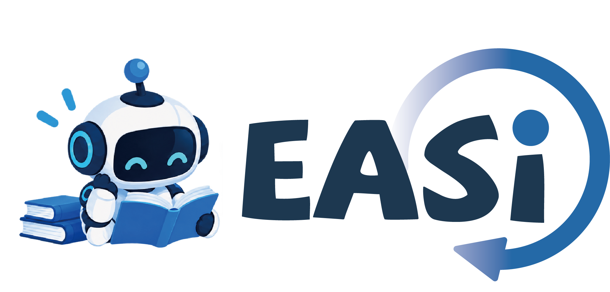

  

# EASi: Embodied Agent Self-improvement

<a href="https://github.com/Yue-105">Yue Yu</a>1,2&nbsp;&nbsp;
Junhui Li1,2&nbsp;&nbsp;
Bin Zhu3&nbsp;&nbsp;
Jiayu Wang1,2&nbsp;&nbsp;
<a href="https://jingjing1.github.io/">Jingjing Chen</a>1,2†

1Shanghai Key Lab of Intell. Info. Processing, School of CS, Fudan University 
2Shanghai Collaborative Innovation Center on Intelligent Visual Computing 
3Singapore Management University

This repository is the public implementation of **EASi (Embodied Agent Self-improvement)**, a self-evolution framework that enables a fixed general-purpose model to learn from its own interactions with the environment. EASi progressively attributes observed successes and failures to explicit adjustments and accumulates reusable knowledge across interaction rounds, allowing the agent to continuously refine how it solves a task. EASi achieves substantial improvements on challenging fine-grained manipulation tasks **without task-specific training or given demonstrations**. **Code and paper will be released soon.**

## Demo

https://github.com/user-attachments/assets/b0368979-b9d5-4216-8e5e-f5852abb1ef1

Using EASi, **GPT-6 Astra learns to solve a new plug-insertion task within four rounds of self-exploration**. The key challenge is to pick up the plug from a flat initial state with an appropriate gripper configuration for subsequent insertion, and then accurately insert it vertically into the socket.

<!--
Embed the demo here using GitHub's native video player:
1. Edit this README on github.com.
2. Drag assets/demo_plug.mp4 directly into this location.
3. GitHub will upload it as a user attachment and insert a standalone URL.
4. Keep that generated URL on its own line; GitHub will render it as an inline video player.
-->
